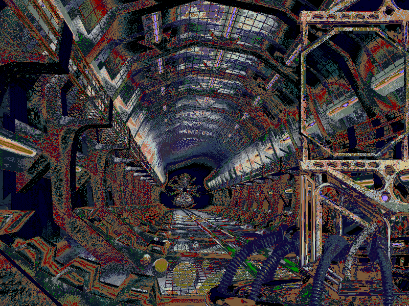

# Introduction
Experiments in the file formats for the game Submarine Titans.

# Archives
Files are stored in archives files, with each archive file being split into two, an index file (dkx) and a data file (dkd).
Reading the archive files largely seems to work but does have some issues where we end up at the correct offset but the data we expect is not there, so we read invalid info.

All extracted files are lacking their header information.

# Sounds
Adding a WAV header for signed 16 bit little endian stereo, 11,025hz to the sounds effects creates usable files.
The same WAV header works for music but has a constant loud hiss and crackle, so we're likely pulling in some unrelated bytes into the sound stream.

# Images
There are several bitmap images in the archives. Adding a generic bitmap header results in mostly viewable files, though with an incorrect palette.
Several files require additional manipulation, as a section from the right side of the image is rendered on the left side of the image.

# Other
The file formats of the other file types are completely unknown.

FACE1_WS

BOATS_5_38

BUT_PATROL_WS0

